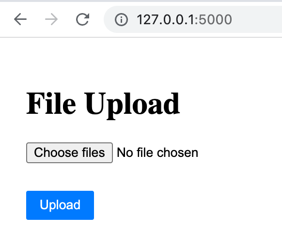
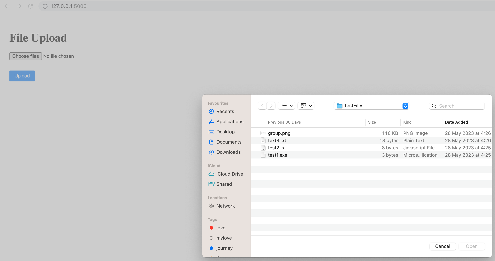
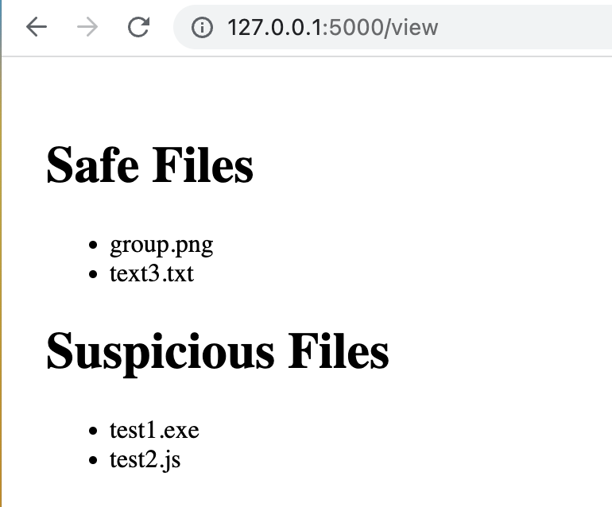

# Automated File Classifier and Safety Assessor

This project demonstrates a multi-agent system for classifying and assessing files. The project consists of four agents:

1. **File Upload Agent**: Responsible for handling the file upload process.
2. **File Classifier Agent**: Determines the file type and classifies files as "safe" or "suspicious" based on a predefined list of potentially harmful file types.
3. **File Movement Agent**: Moves files to their respective folders ("safe" or "suspicious") based on their classification.
4. **View File Agent**: Displays the list of classified files to the user.

## Table of Contents
  * [Used Technologies](#used-technologies)
  * [Project Structure](#project-structure)
  * [How to Run the Application](#how-to-run-the-application)
  * [Features and Implementation](#features-and-implementation)

### Used Technologies
  * Python 3
  * Flask micro web framework

### Project Structure
------------

    |-- README.md          <- README file for the detailed development and 
    |                         testing guide of the application.
    |
    |-- app.py             <- The initial Python file of the application that 
    |                         sets up the Flask server and defines the routes.
    |
    |-- templates          <- The folder that contains HTML files for user 
    |                         interface of the application.
    |    |-- upload.html
    |    |-- view.html
    |
    |-- .gitignore         <- gitignore file that has added the list of cache files 
    |                         to ignore when committing to GitHub.
    |
    |-- images             <- The folder that contains screenshoots of the 
    |                          user interface of the application.
    |                         
    

### How to Run the Application
  #### 1. Run on Computer
  * Install [Python 3](https://www.python.org/downloads/) on your machine.
  * Install Flask using pip: **`pip3 install flask`**
  * Download or clone the project from the source repository.
  * Navigate to the project directory from the terminal: **`cd your_file_path/FileClassifier`**.
  * Run the Python program: **`python3 app.py`**
  * Open your web browser and navigate to `http://localhost:5000/` to see the application.

### Features and Implementation
  ##### 1. File Upload
  - Users can upload multiple files at once through the file upload interface.

      
      *Figure.1.1. File Upload Interface*
  
      
      *Figure.1.2. Browse File  Interface*
  
  ##### 4. Viewing Classified Files
  - Users can view the list of classified files on a separate page. Files in both the "safe" and "suspicious" categories are displayed.

      
      *Figure.2.1. Viewing Classified Files*  

